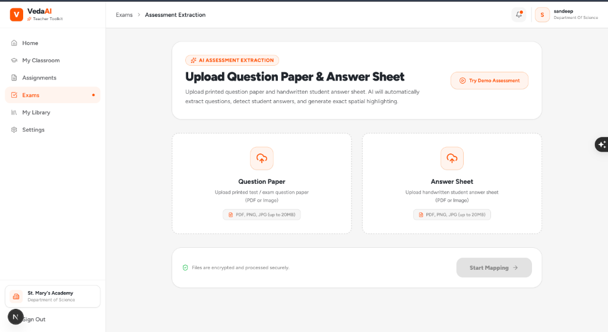
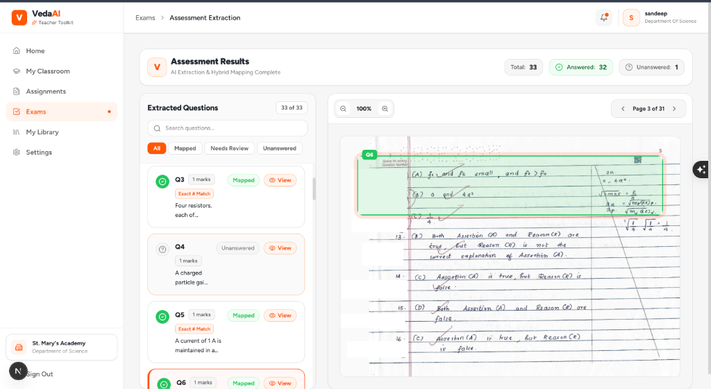
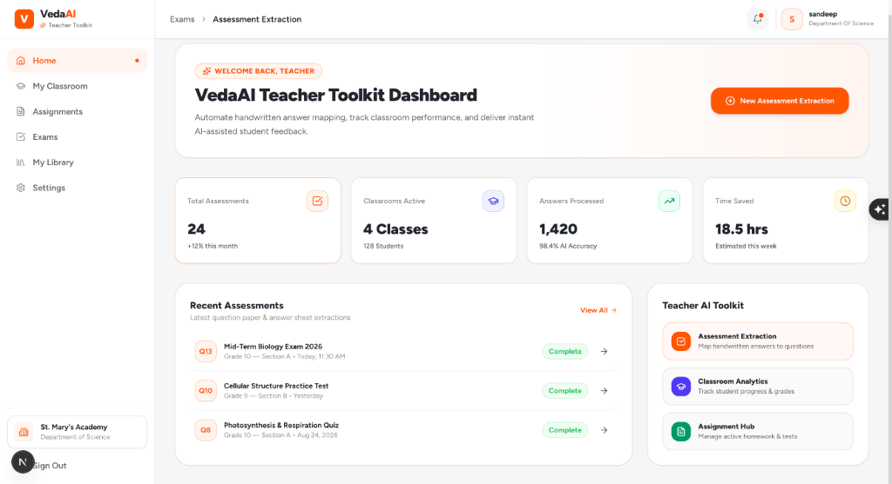
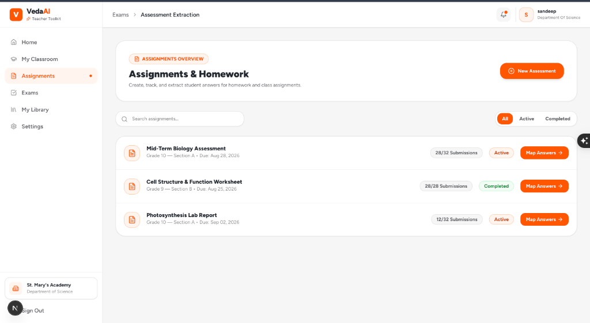
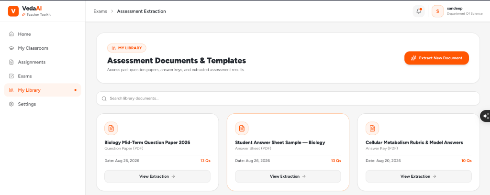
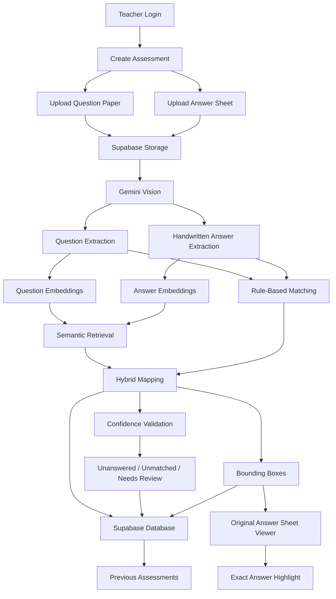

# VedaAI

VedaAI is an AI-assisted assessment workspace for teachers. It turns a printed question paper and a handwritten student answer sheet into a reviewable question-to-answer map, including the exact answer-sheet region for each mapped answer.

The product is designed around three questions:

- Which questions were answered?
- Where is each answer on the student's paper?
- Which questions need review or were left unanswered?

## Product Tour

### Upload an assessment

Teachers upload a question paper and one student answer sheet as PDF, PNG, or JPG files. Each file is limited to 20 MB.



### Follow processing progress

Processing runs asynchronously. The progress screen reports rendering, question extraction, handwriting reading, embedding generation, answer mapping, and confidence validation before navigating to the results.

### Review the mapping

The results screen places the extracted question list beside the answer-sheet viewer. Selecting a question navigates to the relevant answer-sheet page and overlays its normalized bounding box. Answers that continue onto another page can contain multiple regions.



### Workspace screens







## How It Works

The reviewer-facing workflow is:

```text
Teacher Login
     |
Create Assessment
     |
Upload Question Paper + Handwritten Answer Sheet
     |
Supabase Storage
     |
Gemini Vision
     |
Question Extraction + Answer Extraction
     |
Question Number / Structure Detection
     |
Gemini Embeddings
     |
Semantic Retrieval
     |
Rule-Based + Semantic Hybrid Mapping
     |
Confidence Calculation
     |
Unanswered / Unmatched / Needs Review Detection
     |
Bounding Box Generation
     |
Original Answer Sheet Viewer
     |
Question -> Correct Answer Page -> Exact Highlight
     |
Results Saved in Supabase
     |
Previous Assessment Available Again
```

### Architecture diagram



### Stage-by-stage data flow

1. **Teacher Login:** Supabase Auth validates teacher credentials and maintains the session through the server client and middleware. The result is an authenticated teacher identity consumed by protected dashboard routes.
2. **Create Assessment:** the teacher starts an assessment from the Exams area. The application creates a job ID and uses it to associate both source documents, processing status, and eventual results.
3. **Upload documents:** the server accepts PDF, PNG, and JPG files, validates extensions, MIME types, non-empty content, and the 20 MB limit, then stores the files for processing. The next stage receives the two document paths and job ID.
4. **Supabase Storage:** in the production design, the source files are stored in Supabase Storage and referenced by the assessment record. The extraction service consumes those stored files as page images or PDF input. The current local adapter writes files under `UPLOAD_DIR`, which is documented in [Current Implementation Status](#current-implementation-status).
5. **Gemini Vision:** Gemini Vision analyzes printed pages and handwritten pages. It produces structured question records and answer records rather than presentation-specific UI data.
6. **Question extraction:** each question record retains the original number, full text, source page, marks, and section. Labelled sub-parts such as `11(a)` and `11(b)` remain separate records so the mapping has the same granularity as the paper.
7. **Answer extraction:** each answer record contains transcribed text, the handwritten question number when visible, a confidence value, and one or more page regions. Regions use normalized `{ x, y, width, height }` coordinates so they remain usable at different viewer sizes.
8. **Question number and structure detection:** question and answer numbers are normalized for comparison while the original display value is preserved. This gives rule matching a reliable key without losing how the teacher saw the number on the source document.
9. **Gemini Embeddings:** question and answer text is converted into vectors. The retrieval layer consumes those vectors to find likely answers when explicit numbering is missing, inconsistent, or written out of order.
10. **Semantic retrieval:** an in-memory vector index ranks candidate answers by cosine similarity. The highest valid candidate becomes a signal for the hybrid matcher, not an unconditional match.
11. **Hybrid mapping:** deterministic question-number matching runs first. Remaining candidates combine semantic similarity with answer-page position, allowing the system to handle out-of-order responses while preserving a clear confidence score.
12. **Confidence and edge-state detection:** mappings are classified as `matched`, `uncertain`, or `unanswered`. Answers not consumed by a mapping remain unmatched for review. The processing job also records failures so the UI can show an error and offer retry navigation.
13. **Bounding boxes and viewer:** the selected mapping identifies an answer ID, page, and normalized region. The original answer-sheet page is rendered, coordinates are transformed to the displayed document dimensions, and the exact answer area is highlighted. Multiple regions support answers spanning pages.
14. **Persistence:** in the production design, assessment metadata, extraction output, mappings, confidence values, page references, and bounding boxes are saved in Supabase Database, allowing the teacher to reopen previous assessments after refresh or a server restart.

This separation keeps extraction, retrieval, matching, validation, and presentation independently testable. It also makes the AI provider replaceable without changing the viewer or mapping contract.

## What This Assignment Demonstrates

### 1. Accuracy of Question Extraction

Real uploaded question papers enter the server-side extraction pipeline. Each extracted question retains its printed number, text, marks, section, and source page. The data model preserves the original display number while storing a normalized form for matching. Labelled sub-parts such as `11(a)` and `11(b)` are represented as separate question records rather than being merged.

### 2. Accuracy of Answer Mapping

VedaAI uses a hybrid strategy:

- Rule-based matching compares normalized question numbers first.
- Embeddings provide semantic similarity for answers without a reliable visible number.
- Similarity and positional signals contribute to the final confidence score.
- Page/location information helps when answers were written out of order.
- Low-confidence candidates are marked `uncertain` or **Needs Review** instead of being presented as certain matches.

### 3. Correct Highlighting of Answers

The uploaded answer sheet is rendered page by page. Every extracted answer stores its page and normalized bounding box. The viewer transforms those coordinates to the rendered document dimensions, opens the page associated with the selected mapping, and draws the exact answer-region overlay. Selecting a question therefore takes the teacher from question to answer page to highlight. Multi-page answers store and render one region per page.

### 4. Edge Cases

The implementation accounts for:

- **Unanswered questions:** questions without a valid mapping are shown as `unanswered`.
- **Out-of-order answers:** question-number matching and semantic retrieval do not depend on answer order.
- **Unmatched answers:** answer records not assigned to any question remain available as unmatched review signals.
- **Labelled sub-parts:** values such as `11(a)` and `11(b)` retain separate identities.
- **Multi-page answers:** an answer can contain multiple page-region records.
- **Low-confidence mappings:** uncertain matches are surfaced for teacher review.
- **Invalid or failed processing:** upload validation rejects unsupported, empty, or oversized files; failed jobs expose an error state and retry path.
- **PDF and image uploads:** PDF, PNG, JPG, and JPEG inputs are supported.
- **Refresh and reopening:** Supabase-backed assessment persistence is the production design for reopening previous assessments; the current local job store limitation is called out below.

### 5. Quality of Implementation

The application uses a Next.js and TypeScript architecture with separate UI, API, domain, extraction, retrieval, mapping, and provider layers. It includes Supabase Auth clients and protected-route middleware, server-side asynchronous processing, file and schema validation, structured error handling, responsive layouts, and explicit processing states. Supabase Storage and Database provide the production persistence boundary, while Gemini Vision and Gemini Embeddings are the intended production AI adapters. The mapping and viewer contracts are provider-independent, which keeps the core behavior testable.

### 6. Overall Product Experience

The interface follows the VedaAI/Figma-inspired visual direction and keeps the teacher workflow direct: authenticate, upload, monitor progress, select a question, and inspect the highlighted answer. The responsive desktop and mobile layouts include loading states, progress feedback, toast/error messaging, retry handling, interactive question selection, an answer-sheet document viewer, zoom and page navigation, and exact answer highlighting.

## Technology Used

- **Next.js and TypeScript:** application routes, server-side processing, typed domain models, and responsive UI.
- **Gemini Vision:** printed question extraction, handwriting transcription, question-number detection, page information, and answer-region detection.
- **Gemini Embeddings:** semantic representations used to retrieve likely question-answer pairs.
- **Supabase Auth:** teacher signup, login, session management, and protected routes.
- **Supabase Storage:** source question papers and handwritten answer sheets.
- **Supabase Database:** assessment metadata, extracted content, mappings, confidence, processing status, pages, and bounding boxes.
- **PDF and image processing:** uploaded documents are rendered for extraction and visual verification.

The processing layer is server-side and asynchronous. Results are persisted with the assessment so a teacher can return to a previous assessment after refreshing or reopening the application.

## Local Setup

### Requirements

- Node.js 20 or newer
- npm
- Supabase project credentials for real authentication
- AI provider credentials for real document processing

### Install and run

```bash
npm install
npm run dev
```

Open [http://localhost:3000](http://localhost:3000), go to **Exams**, and either select **Try Demo Assessment** or upload both files.

### Environment variables

Create `.env.local` with the Supabase settings:

```env
NEXT_PUBLIC_SUPABASE_URL=your_supabase_project_url
NEXT_PUBLIC_SUPABASE_PUBLISHABLE_KEY=your_supabase_publishable_key
```

For the currently active local AI adapter, use:

```env
OPENAI_API_KEY=your_openai_api_key
AI_MODEL=gpt-4o
EMBEDDING_MODEL=text-embedding-3-small
```

When the Gemini adapter is enabled, the corresponding configuration is:

```env
GEMINI_API_KEY=your_gemini_api_key
GEMINI_EMBEDDING_MODEL=gemini-embedding-2
```

Optional processing configuration:

```env
UPLOAD_DIR=./tmp/veda
CONFIDENCE_HIGH=0.82
CONFIDENCE_MEDIUM=0.55
```

## Useful Commands

```bash
npm run dev     # Start the development server
npm run lint    # Run ESLint
npm run build   # Create a production build
npm run start   # Start the production server
```

## Project Structure

```text
app/                    Next.js pages, layouts, protected routes, and APIs
components/             Upload, processing, results, and answer-sheet UI
lib/pipeline.ts         Asynchronous assessment processing orchestration
lib/extraction/         PDF parsing and question/answer extraction
lib/mapping/            Deterministic and semantic answer matching
lib/retrieval/          Semantic retrieval and cosine similarity
lib/ai/                 Swappable vision and embedding provider adapters
lib/jobs/               Assessment processing job state
utils/supabase/         Browser, server, and middleware Supabase clients
public/screenshots/     Product screenshots used in this README
```

## Known Limitations

- Extraction quality depends on document scan quality and handwriting legibility.
- Very complex layouts, diagrams, or ambiguous question numbering may require teacher review.
- Low-confidence mappings are surfaced as **Needs Review** rather than silently accepted.
- Automated grading and AI feedback are outside the current assessment-mapping scope.

## Deployment Checklist

Before deploying for real teacher data:

- Configure Supabase Auth, Storage, Database, and row-level access policies.
- Replace local uploads and the in-memory job store with durable storage and a shared job queue.
- Enable the Gemini vision and embedding adapters, then validate extraction on representative papers.
- Add file cleanup, rate limiting, access control, and observability around processing jobs.
- Set the required environment variables in the hosting platform.
